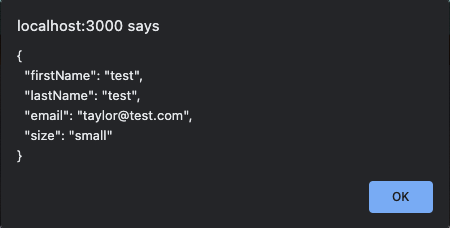

# Intro to Form Libraries

## Pie of the Week

In this lab, we'll be signing up for a fictional subscription service called Weekly pie. Every week, Weekly Pie will deliver you a surprise pie. When we sign users up, we'll collect their pie preferences, in addition to their basic contact information.

## Objectives

- Understand _why_ we use form libraries
- Implement form libraries to create a basic sign up form with fully functional state management, input validation, and error-handling.

## Why?

This lab is designed to get you interacting with form libraries. There are a wide variety of form libraries and ways to handle form behavior in general. Once you get used to the core functionality of a single library, however, the learning curve for other libraries will be less steep. For the purposes of this lab, we'll focus on two of the most commonly used libraries at Giant Machines: [Formik](https://formik.org/) and [Yup](https://www.npmjs.com/package/yup).

In previous experiences, you may have built forms from scratch. So, you may be wondering why we use libraries like Formik and Yup to handle form behavior for us. Simply put, many forms have very similar behaviors, and using libraries like Formik and Yup help save time and write more concise code for these predictable form behaviors, in addition to ensuring consistent handling of edge cases and error states. Or, as the library's repo description reads, "Build forms in React, without the tears 😭"

# Key Vocab

- `validation` - the process of checking input values prior to submitting to ensure correct data types, formats, etc.

## Getting Started

1. Clone this repository down to your local environment and navigate to the root directory. Run `npm install` and then `npm start` to ensure you can preview your app.

1. Take some time to explore the app as it currently exists. Notice that we have created the `SignUpForm` component already - this is where you'll do the majority of your work for this lab.

## Mock Up

## Guidance

1. **Create the initial form structure** - Create an uncontrolled form with the fields `firstName`, `lastName`, `email`, and `pieSizePreference`. Leave this unstyled, we'll take care of styling at the end.
2. **Add Formik to handle your forms state management** - Note that you should be using the [useFormik hook](https://formik.org/docs/api/useFormik), not the `<Formik>` component. Let Formik handle the storing of values, errors, and touched states. By the end of this you should be able to see the values and touches states from Formik when you interact with your form.
3. **Form Validation** - Our form does not have any error states, so lets add form validation with Yup. For now, you can use these validation rules: first name and last name are longer than 2 characters and shorter than 50 characters, the email is a valid email address (hint: take a close look at the Yup docs), and that a size has been selected. Use the errors from the Formik state to render the error messages beneath your inputs.
4. **Handle Submit** - Check to make sure your form works by writing an onSubmit function that creates an alert with all of the stored form values. You'll know you were successful in submitting the form for now if you can see something like this as an alert:

    

    Check to make sure that you can't submit and see the alert if you have inputted an invalid first name, last name or email, or have failed to provide a pie size.

5. **Add in styling using Styled Components** - Refactor your form to match the mockup by creating styled components. By the end of this refactor, you should have the `first name`, `last name`, `email`, and `pie size` fields on your form matched to the mock-up, using exclusively styled components. A quick visual check of your code should show no raw HTML elements - all should be named styled components.

## Extensions

Once you are done with the core exercises above, you are welcome to choose any of the below extensions:

1. Add a button that allows you to add multiple people's first name, last name, email, and pie size. This will teach you how Formik handles arrays of form data.
2. Add the validation rule so that first name and last name cannot be the same thing. This will teach you how you reference other form values for you validations.
3. Try adding additional complex form input types (like a slider or single select with styled buttons), and ensure that their state is still properly stored and manipulated (using the React dev tools).
4. Try repeating the exercise with [React Hook Form](https://react-hook-form.com/), since you'll see both Formik and React Hook Form. This is just another library that handles form state and have a lot of similarities in their core concepts.
